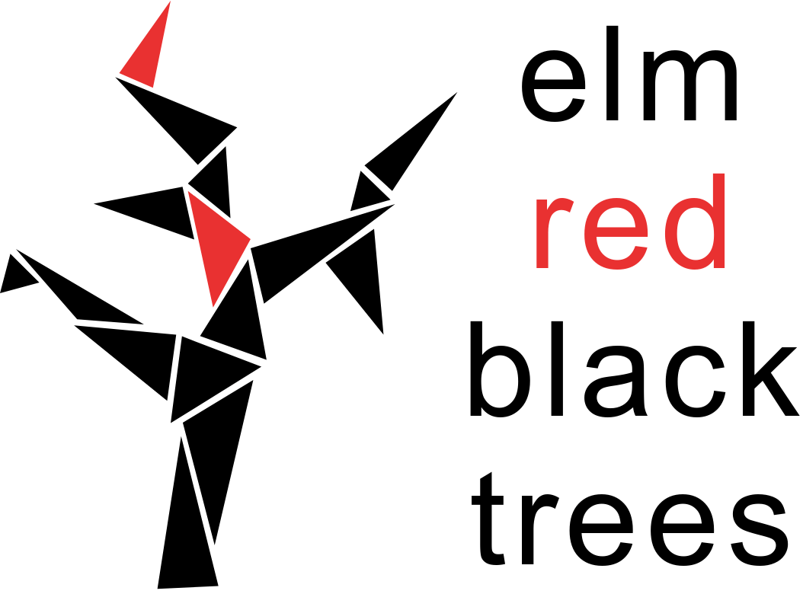

    
    │
    
    │
    

 

Red Black Trees are self-balancing binary search trees which add one bit of memory to the standard BST (usually denoted by the colours red and black).
With this additional tracking information; the worst case search, insert and delete time complexity drops to O(log N) [from O(N) in the BST case].

## License

